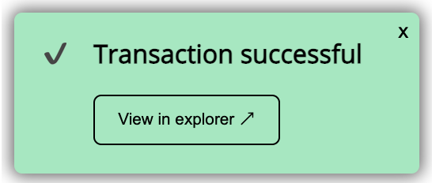

[]

[]

# react-transaction-toasts

[](https://badge.fury.io/js/react-transaction-toasts)
[](https://t.me/erdDEV)
[](https://twitter.com/erd_dev)

React component for visualizing [Elrond](https://elrond.com) transaction progress.

* Tracks transaction progress and reports success/failure.
* Optionally auto-hide a notification once transaction completes.
* Customizable styling.
* Powered by [react-toast-notifications](https://github.com/jossmac/react-toast-notifications).

Live demo: [https://string.erd.dev](https://string.erd.dev)

## Installation

_Note: This package requires React 17 or above._

```shell
npm install --save react-transaction-toasts react@17 elrondjs
```

## Usage

```js
import { useTransactionToasts } from 'react-transaction-toasts'
import { useCallback } from 'react'
import { ProxyProvider } from 'elrondjs'

// React functional component
export default () => {
  const { trackTransaction, showError } = useTransactionToasts()

  const sendTransaction = useCallback(async () => {
    const provider = new ProxyProvider(...)
    const signedTx = ...

    try {
      const ret = await provider.sendSignedTransaction(signedTx)
      trackTransaction(ret.hash, { provider })
    } catch (err) {
      showError(err.message)
    }
  })

  return (
    <button onClick={sendTransaction}>Send</button>
  )
}
```

By default the toast notification automatically disappears after a few seconds for a 
transaction that succeeds. To prevent this happening:

```js
const { trackTransaction, showError } = useTransactionToasts({
  disableAutoCloseOnSuccess: true,
})
```

## Developer guide

This is for anyone working on the this codebase.

Build and watch component:

```shell
yarn dev
```

Build component for production:

```shell
yarn build
```

Build and publish a new release

```
yarn release
```

## License

MIT
